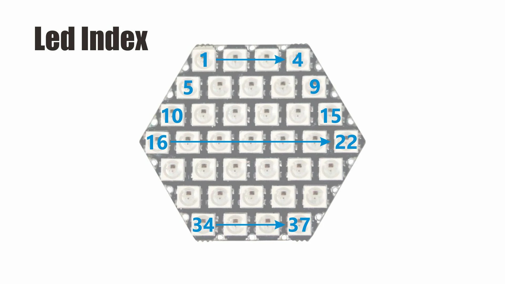

# Units

## Sensor de color

[Color RGB sensor Unit](https://m5stack.com/collections/m5-unit/products/color-unit)

Utiliza conexión I2C sobre el conector groove con dirección 0x29

[Ejemplo para m5stack](https://github.com/m5stack/M5Stack/tree/master/examples/Unit/COLOR_TCS3472)

[Ejemplo para m5stickC](https://github.com/m5stack/M5StickC/blob/master/examples/Unit/Color/Color.ino)

## Hex 37 neopixels

[Hex 37 neopixels](https://m5stack.com/collections/m5-unit/products/hex-rgb-led-board-sk6812)

Necesita de la [librería FastLed](https://github.com/FastLED/FastLED/wiki/Overview)

[Ejemplo](https://github.com/m5stack/M5Stack/tree/master/examples/Unit/HEX_SK6812)

## IR unit

[Ejemplo](https://github.com/m5stack/M5StickC/blob/master/examples/Unit/IR/IR.ino)

En m5stickC ir_recv_pin = 33 & ir_send_pin = 32